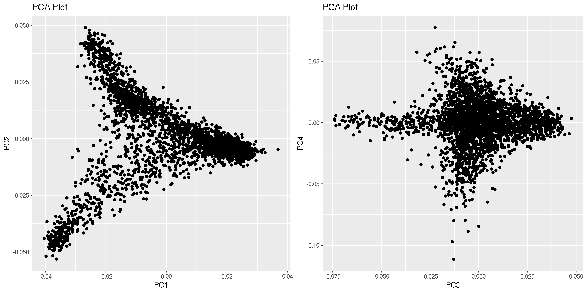

# GRLS_gwas
## Installation
```
conda create --name grlsGWAS
conda activate grlsGWAS
conda install -c bioconda plink
conda install -c bioconda gcta
conda install -c conda-forge r-base=3.6.3
```

## Quality control
```
sh g_qc.sh [input name] [geno] [mind] [maf] [output name]
```

[geno]     filters out all variants over the missing call rates value (recommend 0.1)

[mind]     filters out all samples over the missing call rates value (recommend 0.1)

[maf]      filters out all variants lower than the minor allele frequency value (recommend 0.05)

A log file called 'Quality-control.log' will be created.

## PCA analysis
```
sh PCA.sh [input name] [HW] [ld]
```

[HW]       remove variants that failed the Hardy-Weinberg test (recommend 0.001)

[ld]       remove variants with LD geater than this value (recommend 0.5)

## Principal component analysis (PCA) plot 
Install the 'ggplot' package in the R interface
```
install.packages("tidyverse")
install.packages("ggplot2")
pak::pak("tidyverse/ggplot2")
```

PC1 vs PC2 and PC3 vs PC4 plots are generated by running the following R script
```
Rscript pca_plot.r [input name].eigenvec
```
[input name]  input name should be output prefix generated by PCA analysis



## Sample sheet preparation
A sample sheet (tab delimited), which includes public ID, subject ID, Sex, neutered information, birthday (age) and phenotypes, is required before GWAS analysis. 
```
$head sample_sheet.txt
public_id     ID          Sex     Spayed_or_not  Birthday  hemangiosarcoma
grlsH764T844  094-000019  Female  Neutered       2010-08   0
grls5KPMMUCC  094-000020  Female  Neutered       2011-06   0
grlsUBE49VBB  094-000026  Female  Neutered       2011-09   0
grlsE2Q6OBTT  094-000035  Female  Neutered       2011-06   0
grlsRZT87U00  094-000043  Female  Neutered       2011-04   0
grlsZJRGT144  094-000054  Male    Intact         2011-02   0
grlsYOQLXM44  094-000055  Female  Neutered       2011-02   0
grlsOBKQCCRR  094-000056  Female  Neutered       2011-09   0
```

## GWAS-in-preparation
This step is to extract information for individuals that have both genotype and phenotype. In this case, the phenotype (hemangiosarcoma) is in column 6, hence the varible 'file1_col' euqals to 6. This number should be modified accordingly.

```
cut -f1 sample_sheet.txt | tail -n +2 > phen_id.list
cut -d' ' -f1 AxiomGT1v2.merge.filtered.fam > geno_id.list
cat geno_id.list phen_id.list |sort |uniq -c |awk 'BEGIN{OFS="\t"} $1==2 {print $2,$2}' > gp_ind.list
plink --bfile qced --keep gp_ind.list --make-bed --out test --chr-set 42
file1_col=6
file2_col=2
awk 'BEGIN{OFS="\t"} FNR==NR{arr[$1]=$'$file1_col'; next} {print $0, arr[$1]} ' sample_sheet.txt gp_ind.list > trait1.pheno
```
'trait1.pheno' is generated including phenotype valves
```
$ head trait1.pheno
grls00NB23WW    grls00NB23WW    0
grls01C2L8RR    grls01C2L8RR    0
grls01LNL888    grls01LNL888    0
grls01RDAKNN    grls01RDAKNN    0
grls020IW1ZZ    grls020IW1ZZ    0
grls02RRJK88    grls02RRJK88    0
grls03L3L1FF    grls03L3L1FF    0
grls03MTKHLL    grls03MTKHLL    0
grls03UREW44    grls03UREW44    0
grls0449M0EE    grls0449M0EE    0
```


## GCTA script
A non-ld dataset is required when calculating genomic relationship matrix (GRM)
```
sh non-ld.sh  [input name] [HW] [ld] [output name]
```
[HW]       remove variants that failed the Hardy-Weinberg test (recommend 0.001)

[ld]       remove variants with LD geater than this value (recommend 0.5)

Running GCTA to conduct GRM and GWAS
```
gcta64  --bfile non-ld  --make-grm --autosome-num 38 --maf 0.1  --out non-ld
gcta64 --mlma --bfile test --autosome-num 38 --grm non-ld --reml-alg 1 --pheno trait1.pheno --out trait1
awk '{print $2,$1,$3,$9}' trait1.mlma | grep -v "nan" > trait1.mlma.manh
```
## Manhattan plot and QQ plot
In the R (linux or window) interface, running the following codes to generate Manhattan and QQ plots.
Before that, install the 'qqman' package.
```
install.packages("qqman")
```
```
input_name='trait1'
library(qqman)
test=read.table(paste(input_name,".mlma.manh",sep=""),head=T)
colnames(test)=c("SNP","CHR","BP","P")
snpsOfInterest=test$SNP[which(test$P<=1e-08)]
tiff(paste(input_name,".mlma.manh.tif",sep=""),units="in", width=30, height=10, res=100)
manhattan(test,suggestiveline = F,genomewideline = 8,highlight = snpsOfInterest)
dev.off() 
tiff(paste(paste(input_name,".qqplot.tif",sep=""),sep=""),units="in", width=10, height=10, res=100)
qq(test$P)
dev.off() 
```


